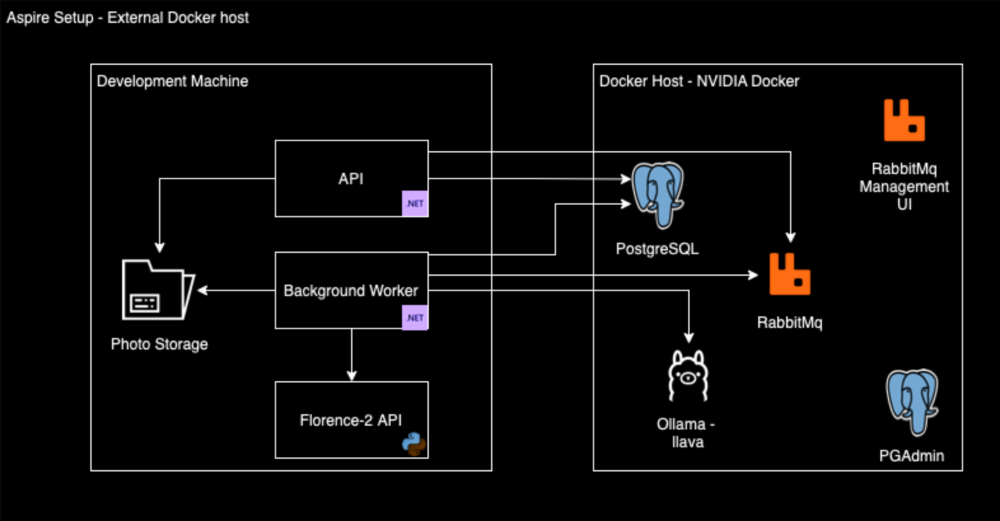
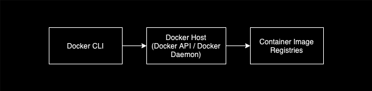
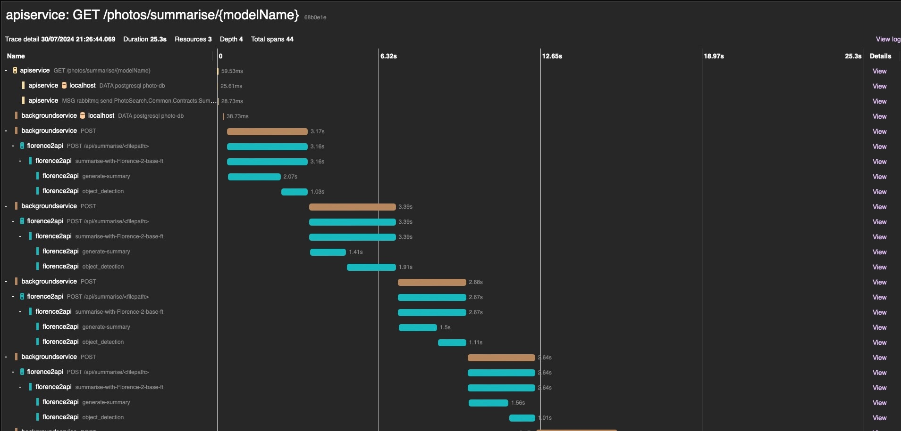

# Exploring .Net Aspire

- Running containers remotely as well as locally.
- Out of the box  distributed tracing across different tech stack.
- Container startup dependencies and health checks.
- Driven by community.
- A brief demo.
---

# Use Case and Current Tasks

- Search photos by natural language.
  - Index photos.
  - Reverse geocode geo tags.
  - Generate detailed summaries using multi modal models.
  - Add front end [TODO]
  - Evaluate Model performance [TODO]
  - Build a Retrieval Augmented (RAG) Generation demo using the components. [TODO]

---

# High Level Overview

<style>
img[alt~="center"] {
  display: block;
  margin: 0 auto;
}
</style>


---

# Docker Host



- Environment variable: 
  - `DOCKER_HOST=ssh://user@ip_address`
- Or directly in docker cli:
  - `docker -H ssh://user@ip_address ps`

---

# Tracing example



---

# Container Startup Dependencies

- There is a functional spike in [GitHub Issue #921](https://github.com/dotnet/aspire/issues/921#issuecomment-2074272361)
  - Define Health Checks on the containers we depend on.
  - Add `.WaitFor` on the projects that should depend on the container.
  - Result:


```c#
var nominatimContainer =
    builder.AddNominatim(name:"Nominatim", hostIpAddress: dockerHost, mapUrl: mapUrl!, hostPort: 8180, imageTag: "4.4")
        .WithPersistence()
        .WithHealthCheck();

var backgroundWorker = builder.AddProject<Projects.PhotoSearch_Worker>("backgroundservice")
    ....
    .WaitFor(nominatimContainer)
    .WaitFor(messaging);
```

---

# Links
- Docker
  - [Container Dependencies GH Issue #921](https://github.com/dotnet/aspire/issues/921#issuecomment-2074272361)
  - [.NET Aspire - Python](https://learn.microsoft.com/en-us/dotnet/aspire/get-started/build-aspire-apps-with-python?tabs=bash)
  - [Docker architecture overview](https://docs.docker.com/guides/docker-overview/#docker-architecture)
  - [DOCKER_HOST environment variable](https://docs.docker.com/engine/reference/commandline/cli/)
  - [.Net Aspire Github issue discussing DOCKER_HOST](https://github.com/dotnet/aspire/issues/1650)
- Models
  - [LLaVA Next](https://llava-vl.github.io/blog/2024-01-30-llava-next/)
  - [LLaVA](https://ollama.com/library/llava)
  - [Florence-2](https://huggingface.co/microsoft/Florence-2-large)
