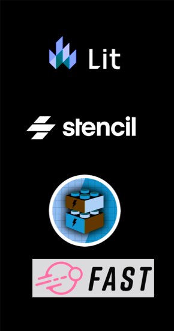
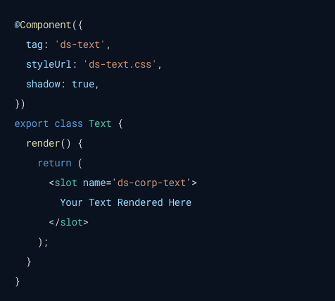
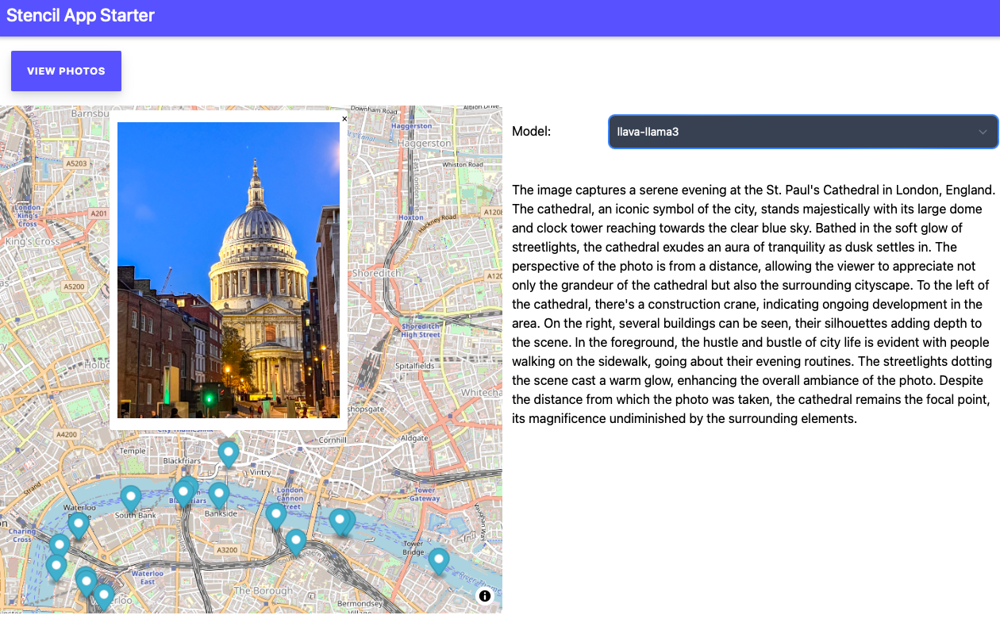

# What are Web Components

- A set of standardized technologies that allow developers to create reusable custom elements with encapsulated functionality.

### Key Technologies:

- Custom Elements: Define new HTML elements.
- Shadow DOM: Encapsulates styles and markup to prevent them from affecting the rest of the page.
- HTML Templates: Define chunks of markup that can be reused without rendering immediately.

---

# Why Use Web Components?

- Reusability: Create components that can be reused across different projects without dependencies on specific frameworks.
- Encapsulation: Prevent styles and scripts from interfering with the global scope, reducing conflicts and bugs.
- Interoperability: Can be used with any JavaScript framework or vanilla JavaScript, making them future-proof.

---

# Web Components vs. Frameworks

- Framework Independence: 
  - Web components are not tied to any specific framework, they are built on browser-native APIs.
- Longevity and Stability: 
  - Web components are built on web standards, ensuring they will be supported long-term without needing to adapt to framework-specific updates.
- Performance: 
  - Web components can be lightweight and optimized, without the overhead of a framework.
- Learning Curve: 
  - Web components can be simpler to learn for those familiar with HTML, CSS, and JavaScript, compared to learning an entire framework.

---

# Tools for Web Components 

- LitElement: A simple base class for creating fast, lightweight web components using lit-html for templating.
- Stencil: A web component compiler that simplifies the process of building scalable, performant, and framework-agnostic web components.
- Salesforce Lightning Web Components: A modern framework for building reusable components in the Salesforce ecosystem, leveraging web standards.
- Microsoft FAST Elements: Support native Web Components and modern Web Standards, to help tackle some of the most common challenges in website and application design and development.

---

# How does it look like? 

---
 

## Demo time

 Show a list of photos on a map and generated summaries using Large Language Models (LLMs).

---

## Summary 
 

- Web components provide a powerful way to build reusable, encapsulated, and interoperable components.
- They are framework-independent and based on web standards.
- Stencil offers a robust tool set for building web components but isn’t the only option.

## Questions?

- Links to follow.

---

## Links

Web Components
  - [Photoshop's journey to the web](https://web.dev/articles/ps-on-the-web)
  - [2023 State of Web Components](https://eisenbergeffect.medium.com/2023-state-of-web-components-c8feb21d4f16)
  - [Are Web Components a Thing Yet](https://arewebcomponentsathingyet.com/)
  - [Libraries and Frameworks and Platforms, Oh My!](https://eisenbergeffect.medium.com/libraries-and-frameworks-and-platforms-oh-my-f77a0ec3d57d)
  - [Debunking Web Component Myths and Misconceptions](https://eisenbergeffect.medium.com/debunking-web-component-myths-and-misconceptions-ea9bb13daf61)
  - [The Many Faces of a Web Component](https://eisenbergeffect.medium.com/the-many-faces-of-a-web-component-fd974e2b1ee6)

Web Component Tooling
  - [Lit](https://lit.dev/)
  - [Stencil](https://stenciljs.com/)
  - [FAST](https://fast.design/)
  - [Salesforce - Lightning Web Components (LWC)](https://developer.salesforce.com/docs/platform/lwc/guide)
